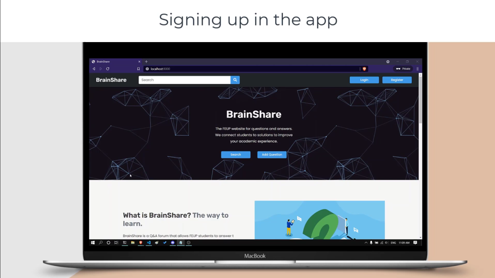

# PA: Product and Presentation

BrainShare's mission is to create a community of FEUP students that allows them to easily obtain an answer to their questions regarding their curricular subject.

## A9: Product

The Brainshare is a question and answer website designed for FEUP students, where people can share their doubts and also learn by answering questions. This the perfect platform to improve the community method of study, providing centered information in one easy and intuitive platform. 


### 1. Installation

 Final version:   [https://git.fe.up.pt/lbaw/lbaw2021/lbaw2152/-/tree/PA](https://git.fe.up.pt/lbaw/lbaw2021/lbaw2152/-/tree/PA)
  
 Docker Command:
 ```
 docker run -it -p 8000:80 -e DB_DATABASE="lbaw2152" -e DB_USERNAME="lbaw2152" -e DB_PASSWORD="VQ245458" lbaw2152/lbaw2152
 ```
 
### 2. Usage

You can access our website going to the following webpage:

[http://lbaw2152.lbaw-prod.fe.up.pt/](http://lbaw2152.lbaw-prod.fe.up.pt/)

#### 2.1. Administration Credentials

| Role | Username | Password |
| - |-------- | -------- |
| Moderator | lbaw2152_moderator@lbaw.com | lbaw2152! |
| Administrator |lbaw2152_admin@lbaw.com    | lbaw2152! |

#### 2.2. User Credentials

| Role          | E-mail                  | Password  |
| ------------- | ------------------------| --------- |
| User account  | lbaw2152@lbaw.com       | lbaw2152! |

#### 2.3 Mailtrap Credentials

| E-mail                      | Password         |
| --------------------------- | ---------------- |
| lbaw2152.recovery@gmail.com | portugal123!lbaw |


### 3. Application Help

- Toasts to indicate feedback to the user
- Tooltips to help the user understand the actions of the icon buttons
- Confirmation modals to critical actions
- Error messages when something unexpected occurs
- User notifications when someone comments their answer or answer their question

### 4. Input Validation

The data was validated at the frontend interface and backend.

#### Frontend Validation
A good and simple example of our frontend validation can be found at the submission of a report: 
```html 
<div class="modal-header">
    <h5 class="modal-title" id="staticBackdropLabel">Report</h5>
    <button type="button" class="btn-close" data-bs-dismiss="modal" aria-label="Close"></button>
</div>
<div class="modal-body">
    <label for="report-content" class="mb-3">What is the cause of the report?</label>
    <textarea class="form-control w-100" id="report-content" maxlength="500" minlength="100" name="content" placeholder="Tell us more..."></textarea>
    <div class="error">
    </div>
</div>
```

#### Backend Validation
We used laravel policies and the methods 'can' and 'authorize' to prevent unauthorized access and actions. Also, we used validators to validate the data before saving it in our database. 

When creating a new question, for example, the user input is first validated using the following block of code. It will check if the content has a title, content and at max two courses and 5 tags, all distinct.
```php
public function create(Request $request){ 
    $this->authorize('create', Question::class);
    
    $validated = $request->validate([
        'title' => 'required',
        'content' => 'required',
        'courseList' => 'max:2',
        'courseList.*' => 'distinct',
        'tagList' => 'max:5',
        'tagList.*' => 'distinct',
    ]);

    ...    
}
```


### 5. Check Accessibility and Usability

Accessibility and usability test results:  

- [Accessibility Test](https://git.fe.up.pt/lbaw/lbaw2021/lbaw2152/-/blob/master/docs/accessibility-usability/accessibility-checklist.pdf)
- [Usability Test](https://git.fe.up.pt/lbaw/lbaw2021/lbaw2152/-/blob/master/docs/accessibility-usability/checklist-usability.pdf)


### 6. HTML & CSS Validation

Validation of the HTML and CSS code:  
- HTML(3 examples):  
    - [Search Page Validation](https://git.fe.up.pt/lbaw/lbaw2021/lbaw2152/-/blob/master/docs/validation/search-html-validation.pdf)
    - [Add Question Validation](https://git.fe.up.pt/lbaw/lbaw2021/lbaw2152/-/blob/master/docs/validation/add-question-html-validation.pdf)
    - [Edit Profile Validation](https://git.fe.up.pt/lbaw/lbaw2021/lbaw2152/-/blob/master/docs/validation/edit-profile-html-validation.pdf)
- CSS: [Css Validation Test](https://git.fe.up.pt/lbaw/lbaw2021/lbaw2152/-/blob/master/docs/validation/css-validation.pdf)

### 7. Revisions to the Project

Since the beginning of the project, we decided to change some user interfaces and user stories that were initially defined in the Requirements Specifications delivery.
In particular, we added two new user stories to cover the Password Recovery and the Manage Reports functionalities.
Also, we had to include some new triggers and attributes to support handling the deletion of questions, answers, comments and users. This allowed us to support reverting a deletion when handling reported content. 
Since the delivery of the Architecture Specification and Prototype component, we also added new modules (Search and Report) and decided to separate the Authentication and User Profile module into two different modules (Authentication and Profile and User Settings).
Moreover, paths from the same module were also uniformed by using the same root for those. 
Since the creation of the website new paths were added and others were changed not only for uniformization but due to code modifications.    

### 8. Implementation Details

#### 8.1. Libraries Used

| | Markdown Editor |
| - |- |
| Link |https://github.com/lepture/editor |
| Function |It is used to create questions and answers with a markdown text editor. It's used on add question page |
| Used on page | [Add Question](http://lbaw2152.lbaw-prod.fe.up.pt/question/add) |

| | Font Awesome |
| - |- |
| Link | https://fontawesome.com/ |
| Function | Icons to use on our webpage |
| Used on page | On the header of every page, for example, [Home](http://lbaw2152.lbaw-prod.fe.up.pt/) |

| | Iconify |
| - |- |
| Link | https://iconify.design/ |
| Function | Icons to use on our webpage |
| Used on page | Mobile search filters |


#### 8.2 User Stories

| US Identifier | Name      | Module   | Priority                       | Team Members               | State  |
| ------------- | --------- | -------- | ------------------------------ | -------------------------- | ------ |
| US02 | View questions & answers list | Question | High/Mandatory | **Diogo Fernandes** | 100% |   
| US14 | Add Question | Question | High/Mandatory| **Diogo Fernandes** | 100% |
| US04 | Advanced Search | Search | High/Mandatory |**Diana Freitas** | 100% | 
| US10 | Sign-in  | Authentication | High/Mandatory | **Diogo Fernandes** | 100% |
| US11 | Sign-up  | Authentication | High/Mandatory  | **Diogo Fernandes**, Diana Freitas | 100% | 
| US18 | Logout | Authentication | High/Mandatory | **Diogo Fernandes** | 100% |
| US26 | Edit/Delete Question | Question | High/Mandatory | **Juliane Marubayashi**, Hugo Guimarães| 100% | 
| US01 | View Home Page | Static Pages | High/Mandatory | **Diogo Fernandes** | 100% |
| US03 | Filtered Search | Search | High/Mandatory | **Diana Freitas**  | 100% |
| US15 | Add Answer | Question | High/Mandatory | **Hugo Guimarães**  |  100%  |
| US06 | Valid answer | Question | High/Mandatory | **Diogo Fernandes**   |  100%  |
| US16 | Add Comment | Question | High/Mandatory | **Hugo Guimarães**  |  100%  |
| US05 | View User Profile | Profile and User Settings | High/Mandatory | **Diogo Fernandes** |  100%  | 
| US17 | Manage Basic Profile | Authentication | High/Mandatory | **Juliane Marubayashi**   |  100%  |
| US29 | Manage Registered Users | Management | High/Mandatory | **Diana Freitas**  |  100%  |
| US19 | Upvote/downvote question| Question | Medium | **Diogo Fernandes** | 100% | 
| US20 | Upvote/downvote answer | Question  | Medium | **Diogo Fernandes** | 100% | 
| US21 | Delete account | Profile and User Settings | Medium | **Juliane Marubayashi** | 100% |
| US27 | Edit/Delete Answer | Question | Medium | **Hugo Guimarães** | 100% |   
| US28 | Edit/Delete Comment | Question | Medium | **Hugo Guimarães** | 100% |  
| US30 | Change question courses | Management | Medium | **Juliane Marubayashi** | 100% |  
| US31 | Remove questions, answers, and comments | Management | Medium | **Juliane Marubayashi** | 100% |
| US32 | Manage courses and tags | Management | Medium | **Juliane Marubayashi** | 100% | 
| US34 | Manage Moderators | Management | Medium | **Diana Freitas** | 100% |
| US33 | Manage Administrators | Management | Medium | **Diana Freitas** | 100% |
| US08 | Password Recovery | Authentication | Medium | **Diana Freitas** | 100% |
| US22 | Manage Detailed Profile | Profile and User Settings | Low | **Juline Marubayashi** | 100% | 
| US23 | Report content | Report | Low | **Juline Marubayashi** | 100% |
| US35 | Manage Reports | Management | Low | **Diana Freitas** | 100% |
| US24 | Notifications | Profile and User Settings | Low | **Diogo Fernandes** | 100% |

---


## A10: Presentation
 

### 1. Product presentation

BrainShare's mission is to create a community of FEUP students that allows them to easily obtain an answer to their questions regarding their curricular subject.
Its main features include searching, submitting, voting and answering questions.

The main features of our project include:
- Create an Account, login and edit your own profile.
- Search questions about specific topics, a course, tags and text matching.
- Submit a question with specific tags and courses associated. 
- Mark an answer as valid to give credibility to the answer and give the right solution to the others users. 
- Help the community by answering their questions, upvote or downvote them.
- If you have any doubts about an answer, you can comment.
- Report inappropriate content or users to keep the website clean.
- Get a notification whenever someone answers your question or comments your answer.
- Management of users, reports, tags and courses is available for Administrators and Moderators.


> URL to the product: http://lbaw2152.lbaw-prod.fe.up.pt  

### 2. Video presentation


> https://drive.google.com/file/d/16iGHkrcTR8zSu_gBBOT_tDWGz-KY_pwF/view?usp=sharing

---


## Revision history

Changes made to the first submission:

### ER Changelog

1. Corrected orthographic mistakes
2. Fixed user stories description
3. Added US18: Upvote/Downvote
4. Added US08: Password Recovery and US33: Manage Reports
5. Added UI08 and UI09 for Password Recovery and Password Reset respectively.
6. Changed User Stories Interfaces
7. Removed Manage categories from UIs and addition of Manage tags and Manage Categories.


### EBD Changelog
1. Added new test user
2. Added new questions
3. Update SQL Script, add new triggers and update old trigger

### EPA Changelog
1. Added new modules (Search and Report)
2. Separated the Authentication and User Profile module in two different modules: 'Authentication' and 'Profile and User Settings'
3. Paths from the same module were uniformed by using the same root for those

***
GROUP2152, 08/05/2021
 
* Group member 1: Diana Freitas, email: up201806230@fe.up.pt, up201806230@g.uporto.pt
* Group member 2: Diogo Samuel Fernandes, email: up201806250@fe.up.pt, up201806250@g.uporto.pt
* Group member 3: Hugo Guimarães, email: up201806490@fe.up.pt, up201806490@g.uporto.pt
* Group member 4: Juliane Marubayashi, email: up201800175@fe.up.pt, up201800175@g.uporto.pt (editor)